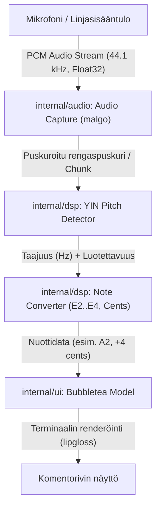

# Suunnitelma: Terminaalipohjainen kitaranviritin Go-kielellä

Tämä dokumentti toimii oppaana ja arkkitehtuurisuunnitelmana reaaliaikaisen, terminaalissa toimivan kitaranvirittimen rakentamiseen Go-kielellä.

---

## 1. Johdanto & Tavoitteet

### Miksi terminaaliviritin?

* **Kevyt ja nopea**: Käynnistyy millisekunneissa suoraan komentoriviltä ilman raskasta GUI-viitekehystä.
* **Oppimisarvo**: Erinomainen johdatus signaalinkäsittelyyn (DSP, Digital Signal Processing), reaaliaikaiseen äänikaappaukseen (Audio Streams) ja interaktiiviseen TUI-ohjelmointiin (Terminal User Interface).

### Tekninen pino

1. **Kieli**: Go 1.22+ (staattinen tyypitys, tehokas suorituskyky, erinomainen standardikirjasto).
2. **Äänen kaappaus**: `github.com/gen2brain/malgo` (miniaudio-kirjaston Go-kääre: integroi C-pohjaisen äänisignaloinnin ilman ulkoisia kehityskirjastojen asennuksia Linux/macOS/Windows-alustoilla).
3. **Sävelkorkeuden tunnistus (DSP)**: YIN-algoritmi toteutettuna puhtaalla Go-koodilla (ei ulkoisia riippuvuuksia, helposti testattavissa synteettisillä aalloilla).
4. **Käyttöliittymä (TUI)**: `github.com/charmbracelet/bubbletea` ja `github.com/charmbracelet/lipgloss` (moderni Elm-arkkitehtuuriin pohjautuva terminaalikäyttöliittymä).

---

## 2. Musiikkiteoria ja signaalinkäsittely (DSP)

### Kitaran standardivire (EADGBE)

Kitara tuottaa äänen värähtelevästä kielestä. Standardivireessä kuuden kielen perustaajuudet ($f_0$) ovat:

| Kieli | Nuotti | Tieteellinen merkintä | Taajuus (Hz) |
|---|---|---|---|
| 6. kieli | E | E2 | 82.41 Hz |
| 5. kieli | A | A2 | 110.00 Hz |
| 4. kieli | D | D3 | 146.83 Hz |
| 3. kieli | G | G3 | 196.00 Hz |
| 2. kieli | B | B3 | 246.94 Hz |
| 1. kieli | E | E4 | 329.63 Hz |

### Miksi pelkkä FFT ei riitä kitaralle?

Fourier-muunnos (FFT) jakaa äänen taajuuskomponentteihin ja etsii huipputehoa.
Akustisessa ja sähkökitarassa – erityisesti matalilla kielillä (kuten E2, 82.4 Hz) – kielen toinen harmoninen kerrannainen (164.8 Hz) tai kolmas (247 Hz) on usein **amplitudiltaan voimakkaampi** kuin perussävel!

Jos käytettäisiin vain FFT-huippua, viritin hyppisi oktaavia ylemmäs (nk. *octave error*).

### Ratkaisu: YIN-algoritmi

YIN (kehittäjät Alain de Cheveigné ja Hideki Kawahara, 2002) on maailmanlaajuinen standardi soitinäänten ja puheen sävelkorkeuden tunnistukseen. Se perustuu **neliöerojen autokorrelaatioon**:

1. **Difference Function $d_t(\tau)$**: Laskee aaltomuodon ja sen viivästetyn version erotuksen neliösumman ikkunassa.
2. **Cumulative Mean Normalized Difference Function $d'_t(\tau)$**: Normalisoi erotuksen, mikä estää nollaviiveen ($\tau = 0$) väärät havainnot.
3. **Absolute Thresholding**: Valitaan ensimmäinen paikallinen minimi, joka alittaa kynnysarvon (tyypillisesti 0.10–0.15). Tämä löytää todellisen perusjakson eikä sen kerrannaisia.
4. **Parabolinen interpolaatio**: Sovitetaan paraabeli minimipisteen ja sen naapurien välille, jotta saavutetaan alinäytetarkkuus (sub-sample precision) ilman valtavaa näytteenottotaajuuden nostoa.

### Sentit (Cents) ja vireen tarkkuus

Ihmiskorva kuulee sävelkorkeuden logaritmisesti. Puolisävelaskel (esim. C:stä C#:iin) on jaettu 100 senttiin (*cents*).

Heitto sentteinä mitatun taajuuden $f$ ja tavoitenuotin $f_{\text{target}}$ välillä lasketaan kaavalla:

$$\text{cents} = 1200 \times \log_2\left(\frac{f}{f_{\text{target}}}\right)$$

* $0\text{ cents}$: Täydellinen vire.
* $[-3, +3]\text{ cents}$: Hyväksyttävä viritystarkkuus (vihreä indikaattori).
* $<-3\text{ cents}$: Liian matala (flat $\flat$, kiristä kieltä).
* $>+3\text{ cents}$: Liian korkea (sharp $\sharp$, löysää kieltä).

---

## 3. Ohjelmistoarkkitehtuuri

Sovelluksen arkkitehtuuri noudattaa puhdasta kerrosjakoa:



### Hakemistorakenne

```text
guitar_tuner/
├── Taskfile.yml              # Projektin automatisointi ja laatuportit
├── go.mod                    # Go-riippuvuudet
├── go.sum
├── cmd/
│   └── tuner/
│       └── main.go           # Sovelluksen pääpiste ja TUI:n käynnistys
└── internal/
    ├── audio/
    │   └── capture.go        # Äänilaitteen alustus ja PCM-näytteiden luku
    ├── dsp/
    │   ├── notes.go          # Nuottitaajuudet, tunnistus ja senttilaskenta
    │   ├── notes_test.go     # Yksikkötestit nuottilaskennalle
    │   ├── yin.go            # YIN pitch detection -algoritmi
    │   └── yin_test.go       # Yksikkötestit YIN-algoritmille (synteettiset siniaallot)
    └── ui/
        ├── model.go          # Bubbletea TUI-tila ja viestien käsittely
        └── view.go           # Lipgloss-tyylit ja viritysmittarin piirto
```

---

## 4. Vaiheittainen toteutusjärjestys

### Vaihe 1: Alustus ja projektirakenne

1. Alustetaan Go-moduuli: `go mod init guitar_tuner`.
2. Asennetaan ydinkirjastot:
   * `go get github.com/gen2brain/malgo`
   * `go get github.com/charmbracelet/bubbletea`
   * `go get github.com/charmbracelet/lipgloss`
3. Luodaan perushakemistot (`cmd/tuner`, `internal/dsp`, `internal/audio`, `internal/ui`).

### Vaihe 2: DSP ja nuottilaskenta (`internal/dsp`)

* Kirjoitetaan nuottitaulukko ja lähimmän sävelen etsintä (`notes.go`).
* Kirjoitetaan YIN-algoritmi (`yin.go`).
* **Testaus**: Kirjoitetaan yksikkötestit, jotka syöttävät YIN-algoritmille matemaattisesti generoituja siniaaltoja (82.4 Hz, 110.0 Hz, 440.0 Hz). Algoritmin toimivuus varmistetaan täysin ennen äänikortin kytkemistä!

### Vaihe 3: Äänen kaappaus (`internal/audio`)

* Määritellään laiteasetukset (44100 Hz, 1-kanavainen mono, Float32-näytteet).
* Luodaan liukuvalla ikkunalla (esim. 2048–4096 näytettä) toimiva kuuntelija, joka toimittaa näytteet DSP-analyysille.

### Vaihe 4: Käyttöliittymä (TUI) (`internal/ui`)

* Luodaan Bubbletea-ohjelmarunko.
* Piirretään visuaalinen mittari:
  ```text
       ┌────────────────────────────────────────────────────────┐
       │                   KITARANVIRITIN                       │
       │                                                        │
       │                         A2                             │
       │                      110.2 Hz                          │
       │                                                        │
       │       ♭  ◄ ◄ ◄ ───┼───●─────── ► ► ►  ♯                │
       │                     +3 cents                           │
       │                                                        │
       │       [E2]  ●[A2]●  [D3]   [G3]   [B3]   [E4]          │
       │                                                        │
       │                    q: Lopeta                           │
       └────────────────────────────────────────────────────────┘
  ```
* Väritetään neula: vihreä kun vire on kohdallaan ($\pm 3$ senttiä), keltainen/punainen kun pielessä.

### Vaihe 5: Integrointi ja testaus kitaralla / mikrofonilla

* Yhdistetään äänikaappauksen tapahtumat Bubbletea-komentoihin/viesteihin (`tea.Msg`).
* Käynnistetään sovellus ja testataan viive (latenssi) sekä tunnistusherkkyys.

---

## 5. Laatuportit ja verifiointi

Ennen käyttöönottoa suoritetaan seuraavat tarkistukset:

1. `go test -v ./...`: Varmistaa, että DSP-yksikkötestit tunnistavat synteettiset kitarasignaalit $\pm 0.5$ Hz tarkkuudella.
2. `go vet ./...`: Tarkistaa koodin staattiset virheet.
3. `go run cmd/tuner/main.go`: Varmistaa sovelluksen suorituskyvyn, mikrofonin liitännän ja reaaliaikaisen TUI-renderöinnin.
